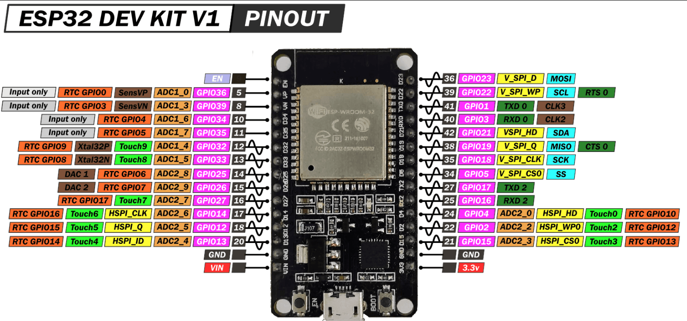
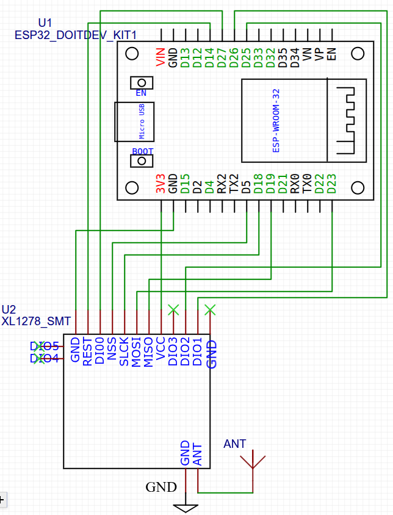
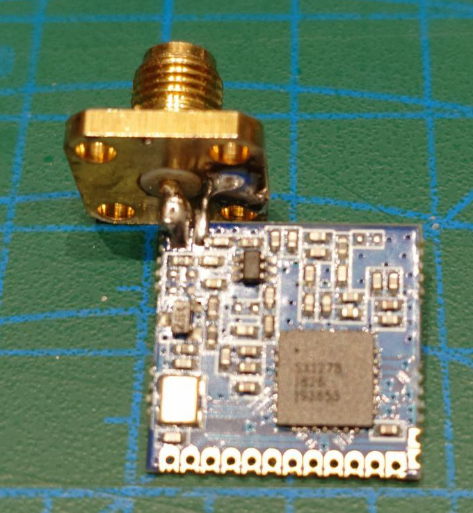
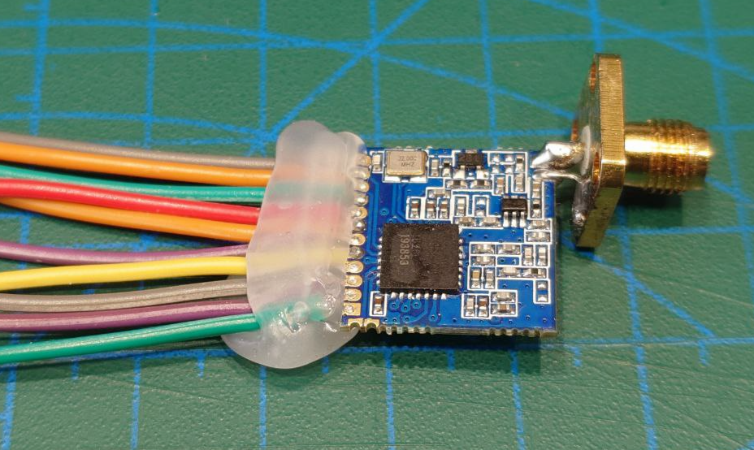
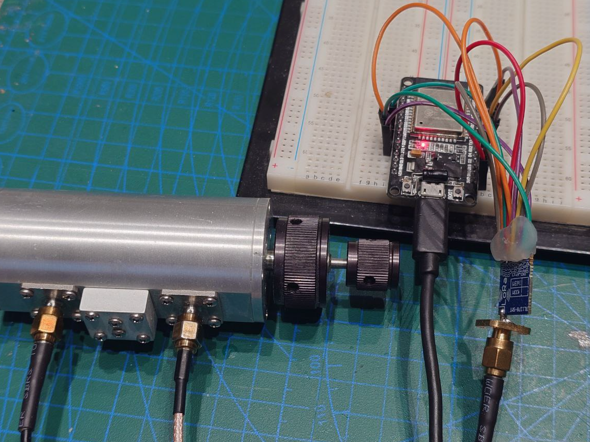
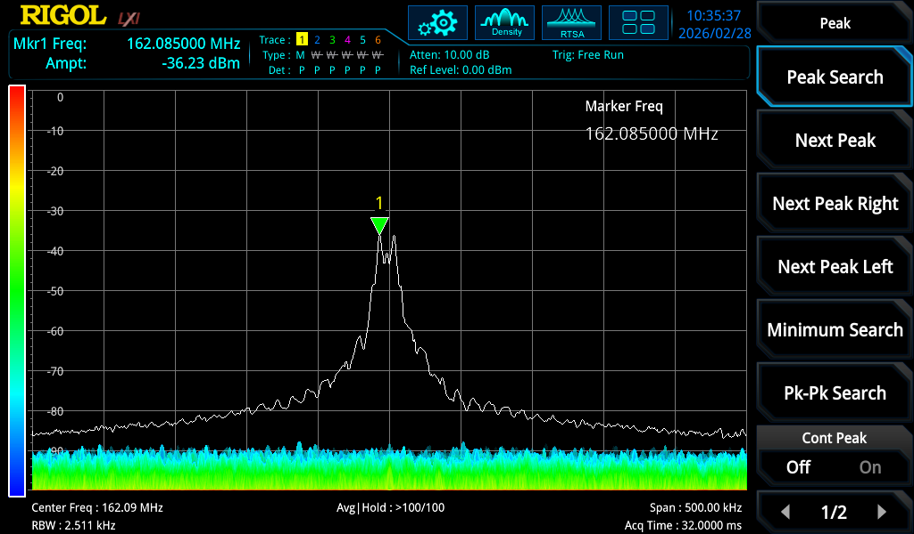
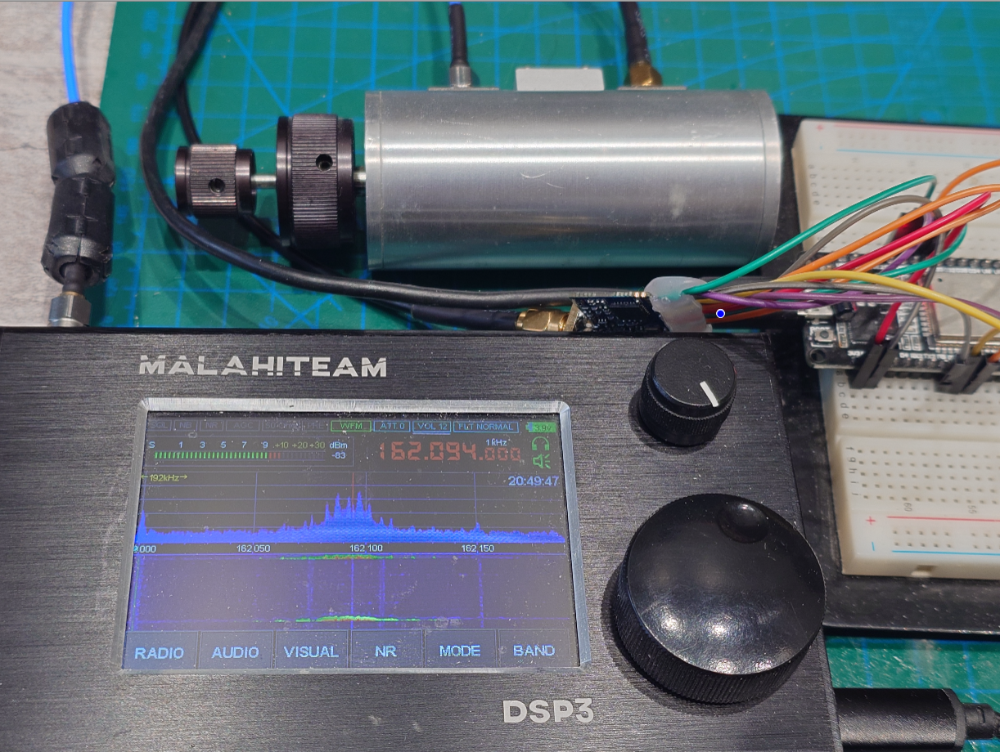
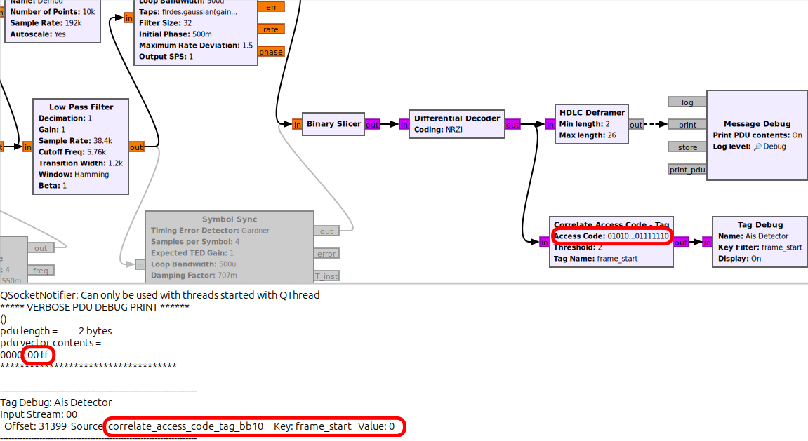

- [esp32\_xl1278](#esp32_xl1278)
  - [Задача](#задача)
  - [Софт](#софт)
  - [Железо](#железо)
  - [Разводка выводов на плате esp32doit-devkit-v1](#разводка-выводов-на-плате-esp32doit-devkit-v1)
  - [Схема подключения плат](#схема-подключения-плат)
  - [Последовательность действий](#последовательность-действий)
  - [Полезные ссылки](#полезные-ссылки)

# esp32_xl1278
Эксперименты подключения esp32 и платы XL1278-SMT

## Задача
Реализовать генератор AIS подобного сигнала на базе XL1278-SMT для отладки AIS приемника

## Софт
1. Операционная система Ubuntu Ubuntu 24.04.3 LTS
2. Visual Studio Code v1.108.2 с Platformio v 3.3.4
3. [EasyEDA](https://easyeda.com) онлайн IDE для разработки радиосхем

## Железо
1. Плата ESP32 [doit-devkit-v1](https://docs.platformio.org/en/latest/boards/espressif32/esp32doit-devkit-v1.html)
2. Плата XL1278-SMT с радиочипом [SX1278](https://github.com/wla-da/ais_lab_tools/blob/main/rf/datascheet/SX1278.pdf)

## Разводка выводов на плате esp32doit-devkit-v1

## Схема подключения плат 

*выводы DIO3, DIO4, DIO5 платы xl1278 не задействованы

## Последовательность действий

0. Припаиваем SMA разъем и Dupont-провода на плату. Неприятным открытием стало, что многие [Dupont-провода](https://www.reddit.com/r/electronics/comments/c3ao57/this_is_why_you_should_avoid_cheap_dupont_wire/?tl=ru) по факту сделаны из омедненного алюминия или стали и паяются очень плохо. 
 
   

1. Соединяем монтажные платы, вполне стандартная распиновка подключения шины SPI ([VSPI](https://docs.espressif.com/projects/esp-idf/en/v3.1.6/api-reference/peripherals/spi_master.html)) для ESP32. Не стоит подключать произвольные GPIO ESP32 к периферии, так как часть из них используется при загрузке чипа и может влиять на стабильность работы схемы: "GPIO0, GPIO2, GPIO5, MTDI (GPIO 12), and MTDO (GPIO15) are strapping pins", см [1.3.9 Strapping Pins](https://docs.espressif.com/projects/esp-hardware-design-guidelines/en/latest/esp32/esp-hardware-design-guidelines-en-master-esp32.pdf) 

2. Почти весь код написан с помощью бесплатной версии [ChatGPT](https://chatgpt.com) без использования библиотек: прямое управление SX1278 через регистры по шине SPI. Был приятно удивлен, что код ChatGPT вполне рабочий, особенно, если добавить в промт условия о реальности работы схемы, использования таймингов, задержек и тп. 

В коде реализована подготовка пакета с двумя байтами данных (0x00, 0xFF) с AIS преамбулой, HDLC флагами, расчетом CRC, кодированием NRZI. Далее идет RF-передача примерно раз в 2 секунды подготовленного пакета на частоте 162 МГц с заданной минимальной мощностью +2 дБм (аппаратные ограничения PA в SX1278) и параметрами близкими к реальному сигналу AIS . Не забываем о порядке бит в байте  в пакете AIS - должен быть LSB (младший бит вначале). 

Параметр BT Гауссовского фильтра - произведение ширины полосы пропускания фильтра на длительность одного бита (Bandwidth-Time product) установлен BT=0.3, а не 0.4 как необходимо для AIS из-за аппаратных ограничений чипа SX1278 (может выбираться из ряда 0.3, 0.5 или 1.0). Битрейт для AIS R = 9600 бит/с, индекс модуляции GMSK h = 0.5 (не путать с параметром BT), девиация частоты: f = h * R/2 = 0.5 * 9600/2 = 2.4 кГц (размах девиации частоты 2 * 2.4 кГц = 4.8 кГц). См так же [ITU-R M.1371-1](https://www.itu.int/dms_pubrec/itu-r/rec/m/R-REC-M.1371-1-200108-S!!PDF-E.pdf) п 2.4.1 "GMSK" и п 2.4.2 "Frequency modulation".

Более подробно AIS сигнал разбирали [здесь](https://github.com/wla-da/ais_lab_tools/blob/main/demod/README.md). 

Сделаю оговорку, что код и сама конструкция НЕ является "production ready", а сделаны лишь для удобства отладки приемника AIS и изучении работы с чипом SX1278.

3. Проверяем наличие и параметры сигнала на спектроанализаторе Rigol RSA3015N. Реальная частота ощутимо отличается от ожидаемой 162 МГц ровно: ~162.09 МГц. Это связано с ошибкой округления при записи частоты в регистр SX1278, по факту устанавливается частота ~162.09332 МГц с шагом ~61.035156 Гц. Уровень сигнала без аттенюатора составил около -7,3 дБм при установленном в коде +2 дБм. Т.е. затухание в RF цепях составило порядка 10 дБ. Ожидал более существенных значений. Похоже, на RF-фильтрах платы XL1278-SMT сильно сэкономили. Уровня сигнала с большим запасом достаточно для отладки. Добавил в схему дополнительный аттенюатор на 30 дБ, чтобы не "оглушать" приемник.

4. Проводим запись IQ сигнала с платы XL1278-SMT с помощью приемника Малахит, как описано [здесь](https://github.com/wla-da/ais_lab_tools/blob/main/rec/README.md). Полученная запись IQ сигнала с частотой дискретизации 192 кГц находится [здесь](rec/iq_sx1278.wav).

5. Проводим извлечения полезных данных из IQ сигнала, как [делали](https://github.com/wla-da/ais_lab_tools/blob/main/demod/README.md) с реальным сигналом AIS с помощью GNU Radio (GRC). Не забываем в пайплайне GRC скорректировать значение изменение переноса частоты в FIR фильтре, установить в пределах ± пары килогерц и уменьшить минимальную длину пакета в HDLC Deframer до 2 байт. Убеждаемся, что стабильно детектируется преамбула AIS (24 бита 0101..01) и извлекаются данные (0x00, 0xFF) из HDLC пакетов с проверкой CRC.

## Полезные ссылки
1. Техническая спецификация AIS [ITU-R M.1371-1](https://www.itu.int/dms_pubrec/itu-r/rec/m/R-REC-M.1371-1-200108-S!!PDF-E.pdf)
2. Даташит [SX1278](https://github.com/wla-da/ais_lab_tools/blob/main/rf/datascheet/SX1278.pdf)
